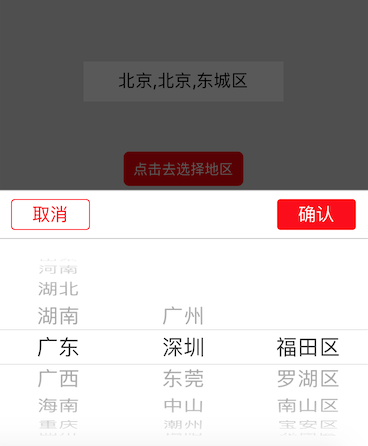

# rn-wheel-picker-china-region

a modal picker(wheel) of china province & city & region.

## propTypes
```
isVisible: PropTypes.bool,
selectedProvince: PropTypes.string,
selectedCity: PropTypes.string,
selectedArea: PropTypes.string,
navBtnColor: PropTypes.string,
animationType: PropTypes.string,
transparent: PropTypes.bool,
onSubmit: PropTypes.func,
onCancel: PropTypes.func,
```

## Install
npm install rn-wheel-picker-china-region --save

## Usage
```javascript
import ChinaRegionWheelPicker from 'rn-wheel-picker-china-region';

// 用法一
<ChinaRegionWheelPicker
  onSubmit={(params) => this.setState({ region1: `${params.province},${params.city},${params.area}` })}
  onCancel={() => console.log('cancel')}
>
  <TextInput
    editable={false}
    placeholder="点击去选择地区"
    value={this.state.region1}
  />
</ChinaRegionWheelPicker>

// 用法二(参考Example目录index.ios.js)
<ChinaRegionWheelPicker
  isVisible={this.state.isPickerVisible}
  navBtnColor={'red'}
  selectedProvince={'广东'}
  selectedCity={'深圳'}
  selectedArea={'福田区'}
  transparent
  animationType={'fade'}
  onSubmit={this._onPressSubmit.bind(this)} // 点击确认_onPressSubmit
  onCancel={this._onPressCancel.bind(this)} // 点击取消_onPressCancel
/>

<TouchableOpacity
  onPress={this._onPress2Show.bind(this)}
>
  <Text style={{ color: 'white' }}>{this.state.region2 || '点击去选择地区' }</Text>
</TouchableOpacity>

```

## Show



